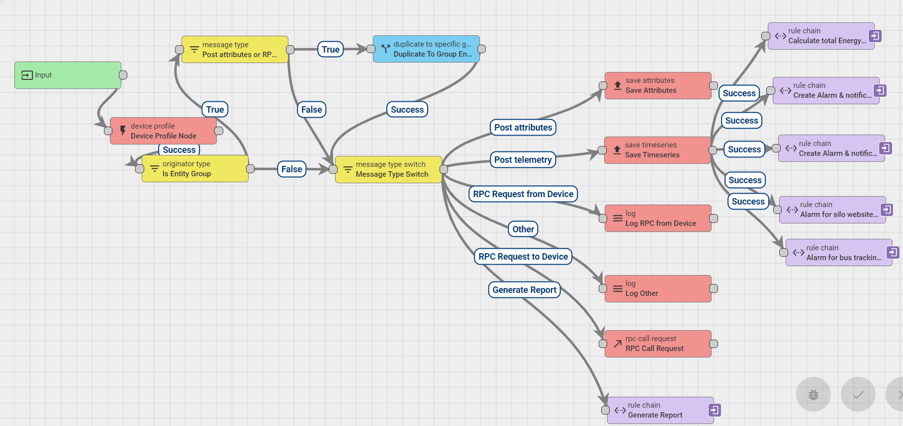
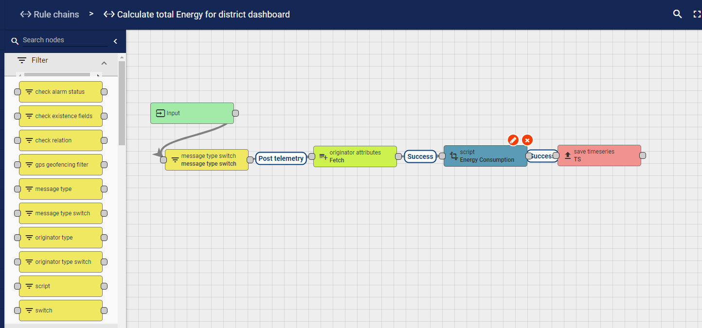
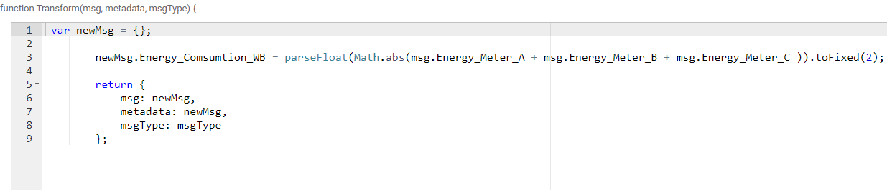

# Smart-metering-solutions-with-ThingsBoard
- IoT smart metering solutions and smart meter data visualization with ThingsBoard

`IoT and smart meters`
- Traditionally being a part of the electrical grid infrastructure, a smart meter is an electronic device that allows for remote monitoring and recording of energy consumption. 
However, in the age of IoT and IoT platforms, standalone smart meters give way to more advanced and multi-purpose smart metering solutions. 
These solutions offer a broader range of remote monitoring and alerting capabilities as well as provide powerful data analytics tools to 
help companies and individual users optimize their energy, water, gas, or fuel consumption.

- A typical challenge for companies implementing smart meters is how to integrate them within their infrastructure and set up custom-tailored smart metering use cases. 
The best way to achieve these goals is by using an IoT platform that offers out-of-the-box solutions and templates for smart metering, such as ThingsBoard. 
One of the strongest advantages of an enterprise-grade IoT platform is its data processing capabilities. 
Not only will you be able to collect data from your diverse smart meters in a centralized way, 
but also set up custom visualization dashboards, configure user alerts and notifications, and feed the collected data into other applications or data stores.

- Another critical advantage is the cost of smart metering implementation. Using an IoT platform allows you to have all the necessary functionality right away and 
focus on building particular smart metering use cases instead, saving time and avoiding the risks associated with in-house IoT development.

`Generate random values use ThingsBoard rule chains`

`Root rule chain,`

`Alarm and Notification`

- I also created alarm and notification for demo dashboard using ThingsBoard rule chains.

`Calculate total energy consumption`

`Smart metering dashboard`

Live Demo: [Smart Metering Dashboard](https://myiot.polisea.ro/dashboard/e917eb00-0589-11ec-9fc0-d7ec4e17a89a?publicId=7cb71a20-041d-11ec-9fc0-d7ec4e17a89a)

Visit our official website: [Polisea S.A](https://polisea.ro/aiot/) 

🚩 Connect with me on social
- LinkedIn: [LinkedIn](https://www.linkedin.com/in/ariful-islam-arif-2987b51a3/)
- Twitter: [Twitter](https://twitter.com/arifulislam301)
- Instagram: [Instagram](https://www.instagram.com/ariful_mr_islam/)

🔔 Subscribe to my YouTube channel: [YouTube](https://www.youtube.com/channel/UCED68cm6nHaAlAk0h9I3yAQ)

